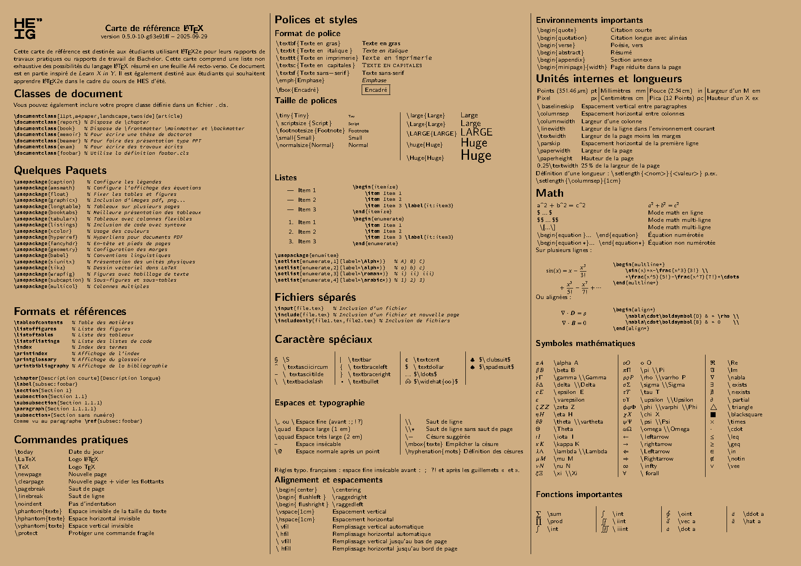

# Carte de référence LaTeX


Cette carte de référence est destinée à accompagner l'étudiant durant ses études d'ingénieur.

## Preview

La carte de référence est une feuille A4 recto-verso supposément imprimée sur du papier 120g satiné violet :

[](https://github.com/heig-tin-info/refcard-latex/releases/latest/download/refcard.pdf)

L'impression via la reprographie de l'école peut être demandée avec la description suivante:

```
papier: A4 120g satiné violet
format: recto-verso, reliure petit-côté à gauche
```

## Build

L'écosystème de compilation s'appuie sur Docker, la compilation est automatique à chaque commit depuis les GitHub Actions.

Une compilation locale est possible avec les outils suivants :

- texlive-full
- latexmk
- git